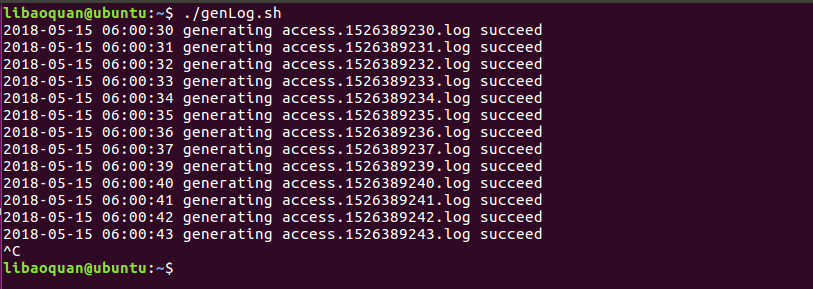
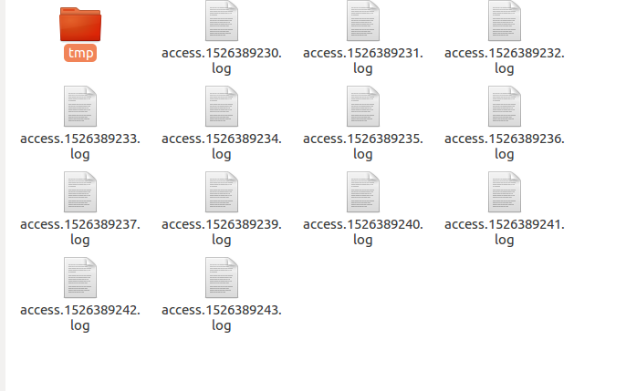
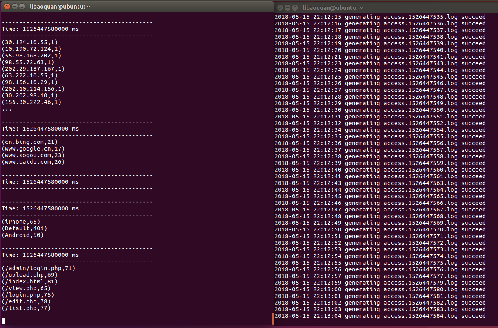

本文基于《Spark 最佳实践》第6章 Spark 流式计算。

> 我们知道网站用户访问流量是不间断的，基于网站的访问日志，即 Web log 分析是典型的流式实时计算应用场景。比如百度统计，它可以做流量分析、来源分析、网站分析、转化分析。另外还有特定场景分析，比如安全分析，用来识别 CC 攻击、 SQL 注入分析、脱库等。这里我们简单实现一个类似于百度分析的系统。

代码见 [https://github.com/libaoquan95/WebLogAnalyse](https://github.com/libaoquan95/WebLogAnalyse)

## 模拟生成 web log 记录
在日志中，每行代表一条访问记录，典型格式如下：
```
46.156.87.72 - - [2018-05-15 06:00:30] "GET /upload.php HTTP/1.1" 200 0 "http://www.baidu.com/s?wd=spark" "Mozilla/5.0 (compatible; MSIE 10.0; Windows NT 6.2; Trident/6.0)" "-"
```
分别代表：访问 ip，时间戳，访问页面，响应状态，搜索引擎索引，访问 Agent。

简单模拟一下数据收集和发送的环节，用一个 Python 脚本随机生成 Nginx 访问日志，为了方便起见，不使用 HDFS，使用单机文件系统。

首先，新建文件夹用于存放日志文件
```
$ mkdir Documents/nginx
$ mkdir Documents/nginx/log
$ mkdir Documents/nginx/log/tmp
```

然后，使用 Python 脚本随机生成 Nginx 访问日志，并为脚本设置执行权限, 代码见 [sample_web_log.py](https://github.com/libaoquan95/WebLogAnalyse/blob/master/sample_web_log.py)
```
#!/usr/bin/env python
# -*- coding: utf-8 -*-

import random
import time


class WebLogGeneration(object):

    # 类属性，由所有类的对象共享
    site_url_base = "http://www.xxx.com/"

    # 基本构造函数
    def __init__(self):
        #  前面7条是IE,所以大概浏览器类型70%为IE ，接入类型上，20%为移动设备，分别是7和8条,5% 为空
        self.user_agent_dist = {0.0:"Mozilla/5.0 (compatible; MSIE 10.0; Windows NT 6.2; Trident/6.0)",
                                0.1:"Mozilla/5.0 (compatible; MSIE 10.0; Windows NT 6.2; Trident/6.0)",
                                0.2:"Mozilla/4.0 (compatible; MSIE 7.0; Windows NT 5.1; Trident/4.0; .NET CLR 2.0.50727)",
                                0.3:"Mozilla/4.0 (compatible; MSIE6.0; Windows NT 5.0; .NET CLR 1.1.4322)",
                                0.4:"Mozilla/5.0 (Windows NT 6.1; Trident/7.0; rv:11.0) like Gecko",
                                0.5:"Mozilla/5.0 (Windows NT 6.1; WOW64; rv:41.0) Gecko/20100101 Firefox/41.0",
                                0.6:"Mozilla/4.0 (compatible; MSIE6.0; Windows NT 5.0; .NET CLR 1.1.4322)",
                                0.7:"Mozilla/5.0 (iPhone; CPU iPhone OS 7_0_3 like Mac OS X) AppleWebKit/537.51.1 (KHTML, like Gecko) Version/7.0 Mobile/11B511 Safari/9537.53",
                                0.8:"Mozilla/5.0 (Linux; Android 4.2.1; Galaxy Nexus Build/JOP40D) AppleWebKit/535.19 (KHTML, like Gecko) Chrome/18.0.1025.166 Mobile Safari/535.19",
                                0.9:"Mozilla/5.0 (Macintosh; Intel Mac OS X 10_10_5) AppleWebKit/537.36 (KHTML, like Gecko) Chrome/45.0.2454.85 Safari/537.36",
                                1:" ",}
        self.ip_slice_list = [10, 29, 30, 46, 55, 63, 72, 87, 98,132,156,124,167,143,187,168,190,201,202,214,215,222]
        self.url_path_list = ["login.php","view.php","list.php","upload.php","admin/login.php","edit.php","index.html"]
        self.http_refer = [ "http://www.baidu.com/s?wd={query}","http://www.google.cn/search?q={query}","http://www.sogou.com/web?query={query}","http://one.cn.yahoo.com/s?p={query}","http://cn.bing.com/search?q={query}"]
        self.search_keyword = ["spark","hadoop","hive","spark mlib","spark sql"]


    def sample_ip(self):
        slice = random.sample(self.ip_slice_list, 4) #从ip_slice_list中随机获取4个元素，作为一个片断返回
        return  ".".join([str(item) for item in slice])  #  todo


    def sample_url(self):
        return  random.sample(self.url_path_list,1)[0]


    def sample_user_agent(self):
        dist_uppon = random.uniform(0, 1)
        return self.user_agent_dist[float('%0.1f' % dist_uppon)]


    # 主要搜索引擎referrer参数
    def sample_refer(self):
        if random.uniform(0, 1) > 0.2:  # 只有20% 流量有refer
            return "-"

        refer_str=random.sample(self.http_refer,1)
        query_str=random.sample(self.search_keyword,1)
        return refer_str[0].format(query=query_str[0])

    def sample_one_log(self,count = 3):
        time_str = time.strftime("%Y-%m-%d %H:%M:%S",time.localtime())
        while count >1:
            query_log = "{ip} - - [{local_time}] \"GET /{url} HTTP/1.1\" 200 0 \"{refer}\" \"{user_agent}\" \"-\"".format(ip=self.sample_ip(),local_time=time_str,url=self.sample_url(),refer=self.sample_refer(),user_agent=self.sample_user_agent())
            print query_log
            count = count -1

if __name__ == "__main__":
    web_log_gene = WebLogGeneration()

    #while True:
    #    time.sleep(random.uniform(0, 3))
    web_log_gene.sample_one_log(random.uniform(10, 100))
```
设置可执行权限的方法如下
```
$ chmod +x sample_web_log.py
```

之后，编写 bash 脚本，自动生成日志记录，并赋予可执行权限，代码见 [genLog.sh](https://github.com/libaoquan95/WebLogAnalyse/blob/master/genLog.sh)
```
#!/bin/bash

while [ 1 ]; do
    ./sample_web_log.py > test.log

    tmplog="access.`date +'%s'`.log"
    cp test.log streaming/tmp/$tmplog
    mv streaming/tmp/$tmplog streaming/
    echo "`date +"%F %T"` generating $tmplog succeed"
    sleep 1
done
```
赋予权限
```
$ chmod +x genLog.sh
```
执行 genLog.sh 查看效果，输入 ctrl+c 终止。
```
$ ./genLog.sh
```




## 流式分析
创建 Scala 脚本，代码见 [genLog.sh](https://github.com/libaoquan95/WebLogAnalyse/blob/master/WebLogAnalyse.scala)
```
import org.apache.spark.SparkConf
import org.apache.spark.streaming.{Seconds, StreamingContext}

val batch = 10  // 计算周期（秒）
//val conf = new SparkConf().setAppName("WebLogAnalyse").setMaster("local")
//val ssc = new StreamingContext(conf, Seconds(batch))
val ssc = new StreamingContext(sc, Seconds(batch))
val input = "file:///home/libaoquan/Documents/nginx/log"  // 文件流
val lines = ssc.textFileStream(input)

// 计算总PV
lines.count().print()

// 各个ip的pv
lines.map(line => (line.split(" ")(0), 1)).reduceByKey(_+_).print()

// 获取搜索引擎信息
val urls = lines.map(_.split("\"")(3))

// 先输出搜索引擎和查询关键词，避免统计搜索关键词时重复计算
// 输出(host, query_keys)
val searchEnginInfo = urls.map( url  => {
  // 搜索引擎对应的关键字索引
  val searchEngines = Map(
  "www.google.cn" -> "q",
  "www.yahoo.com" -> "p",
  "cn.bing.com" -> "q",
  "www.baidu.com" -> "wd",
  "www.sogou.com" -> "query"
  )
  val temp = url.split("/")
  // Array(http:, "", www.baidu.com, s?wd=hadoop)
  if(temp.length > 2){
  val host = temp(2)
  if(searchEngines.contains(host)){
    val q = url.split("//?")
    if(q.length > 0) {
      val query = q(1)
      val arr_search_q = query.split('&').filter(_.indexOf(searchEngines(host) + "=") == 0)
      if (arr_search_q.length > 0) {
        (host, arr_search_q(0).split('=')(1))
      } else {
        (host, "")
      }
    } else{
      ("", "")
    }
  } else{
    ("", "")
  }
  } else{
  ("", "")
  }
})

// 搜索引擎pv
searchEnginInfo.filter(_._1.length > 0).map(i => (i._1, 1)).reduceByKey(_+_).print()

// 关键字pv
searchEnginInfo.filter(_._2.length > 0).map(i => (i._2, 1)).reduceByKey(_+_).print()

// 终端pv
lines.map(_.split("\"")(5)).map(agent => {
  val types = Seq("iPhone", "Android")
  var r = "Default"
  for (t <- types) {
  if (agent.indexOf(t) != -1)
    r = t
  }
  (r, 1)
}).reduceByKey(_ + _).print()

// 各页面pv
lines.map(line => (line.split("\"")(1).split(" ")(1), 1)).reduceByKey(_+_).print()

ssc.start()
ssc.awaitTermination()
```

## 执行
同时开启两个终端，分别执行 genLog.sh 生成日志文件和执行 WebLogAnalyse.scala 脚本进行流式分析。

执行 genLog.sh
```
$ ./genLog.sh
```

执行 WebLogAnalyse.scala, 使用 spark-shell 执行 scala 脚本
```
$ spark-shell --executor-memory 5g --driver-memory 1g --master local  < WebLogAnalyse.scala 
```

效果如下，左边是 WebLogAnalyse.scala，右边是 genLog.sh
