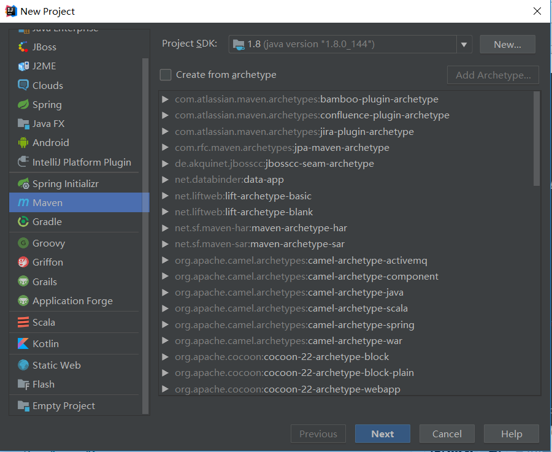
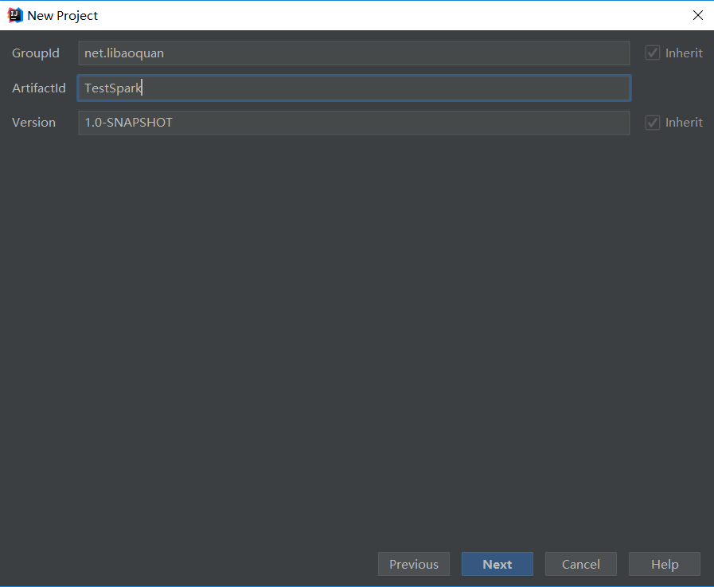
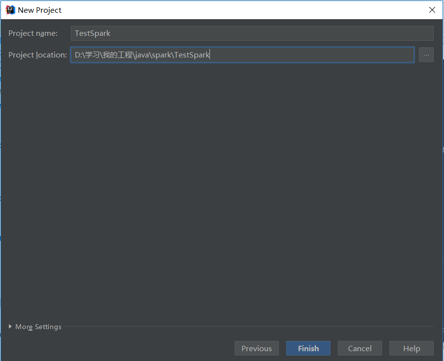
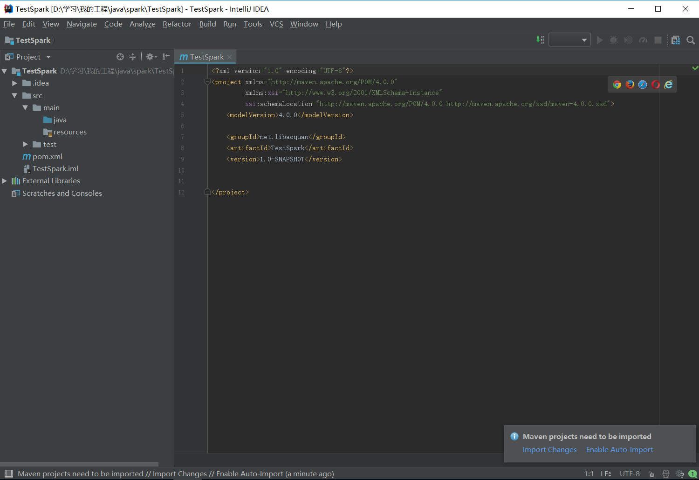
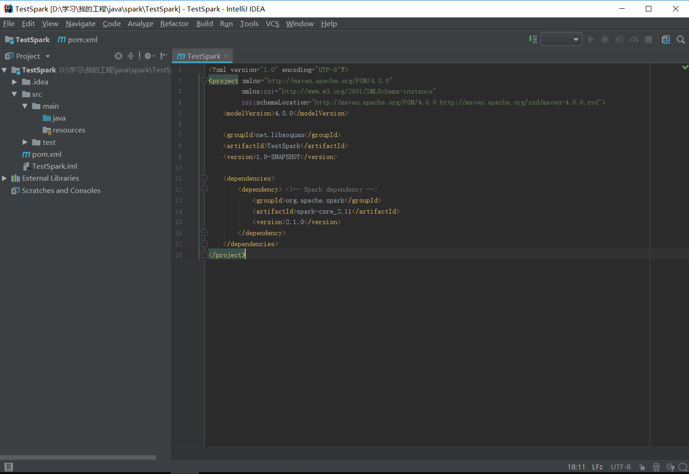
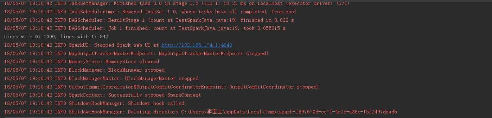

本文主要讲述如何在 IntelliJ IDEA 中配置 Spark(Java API) 运行环境。

### 新建Maven项目



初始Maven项目完成后，初始的配置（pom.xml）如下：


### 配置Maven
向项目里新建Spark Core库
```
<?xml version="1.0" encoding="UTF-8"?>
<project xmlns="http://maven.apache.org/POM/4.0.0"
         xmlns:xsi="http://www.w3.org/2001/XMLSchema-instance"
         xsi:schemaLocation="http://maven.apache.org/POM/4.0.0 http://maven.apache.org/xsd/maven-4.0.0.xsd">
    <modelVersion>4.0.0</modelVersion>

    <groupId>net.libaoquan</groupId>
    <artifactId>TestSpark</artifactId>
    <version>1.0-SNAPSHOT</version>

    <dependencies>
        <dependency> <!-- Spark dependency -->
            <groupId>org.apache.spark</groupId>
            <artifactId>spark-core_2.11</artifactId>
            <version>2.2.1</version>
        </dependency>
    </dependencies>
</project>
```


### 新建Java类
新建Java类，写入Spark(Java API)代码：
```
import org.apache.spark.api.java.*;
import org.apache.spark.SparkConf;
import org.apache.spark.api.java.function.Function;

public class TestSparkJava {
    public static void main(String[] args) {
        String logFile = "D:\\ab.txt";
        SparkConf conf = new SparkConf().setMaster("local").setAppName("TestSpark");
        JavaSparkContext sc = new JavaSparkContext(conf);

        JavaRDD<String> logData = sc.textFile(logFile).cache();

        long numAs = logData.filter(new Function<String, Boolean>() {
            public Boolean call(String s) { return s.contains("0"); }
        }).count();

        long numBs = logData.filter(new Function<String, Boolean>() {
            public Boolean call(String s) { return s.contains("1"); }
        }).count();

        System.out.println("Lines with 0: " + numAs + ", lines with 1: " + numBs);

        sc.stop();
    }
}
```
运行项目，结果如下：
