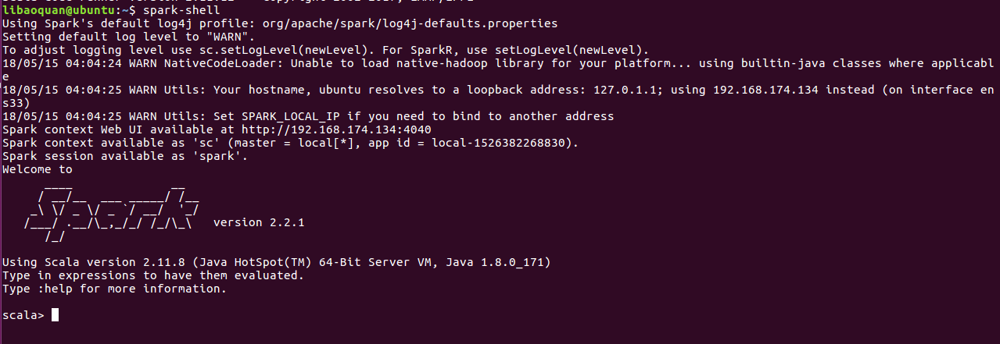

## 准备
本文主要讲述如何在Ubuntu 16.04 中搭建 Spark 2.11 单机开发环境，主要分为 3 部分：JDK 安装，Scala 安装和 Spark 安装。
1. JDK 1.8：[jdk-8u171-linux-x64.tar.gz](http://www.oracle.com/technetwork/java/javase/downloads/jdk8-downloads-2133151.html) 
2. Scala 11.12：[Scala 2.11.12](https://www.scala-lang.org/download/2.11.12.html)
3. Spark 2.2.1：[spark-2.2.1-bin-hadoop2.7.tgz](https://www.apache.org/dyn/closer.lua/spark/spark-2.2.1/spark-2.2.1-bin-hadoop2.7.tgz)

需要注意的是，Spark 版本与 Scala 版本需要匹配一致。

> Note: Starting version 2.0, Spark is built with Scala 2.11 by default. Scala 2.10 users should download the Spark source package and build with Scala 2.10 support.

## JDK 安装
下载 jdk-8u171-linux-x64.tar.gz 后，解压到自己指定目录。
```
$ sudo mkdir /usr/local/java
$ sudo tar -zxvf jdk-8u171-linux-x64.tar.gz -C /usr/local/java
```

配置环境变量,打开 profile 文件
```
$ sudo gedit /etc/profile
```

在文件末尾写入，注意 JAVA_HOME 是 JDK 的安装路径：
```
export JAVA_HOME=/usr/local/java/jdk1.8.0_171 
export JRE_HOME=${JAVA_HOME}/jre 
export CLASSPATH=.:${JAVA_HOME}/lib:${JRE_HOME}/lib 
export PATH=${JAVA_HOME}/bin:${JRE_HOME}/bin:$PATH 
```

保存后退出，运行如下命令，使修改环境变量即可生效:
```
$ source /etc/profile
```

检测java是否成功安装
```
$ java -version
```


## Scala 安装
下载 Scala 2.11.12 后，解压到自己指定目录。
```
$ sudo mkdir /usr/local/scala
$ sudo tar -zxvf scala-2.11.12.tgz -C /usr/local/scala
```

配置环境变量,打开 profile 文件
```
$ sudo gedit /etc/profile
```

在文件末尾写入，注意 SCALA_HOME 是 Scala 的安装路径：
```
export SCALA_HOME=/usr/local/scala/scala-2.11.12 
export PATH=${SCALA_HOME}/bin:$PATH
```

保存后退出，运行如下命令，使修改环境变量即可生效:
```
$ source /etc/profile
```

检测java是否成功安装
```
$ scala  -version
```


## Spark 安装
下载 spark-2.2.1-bin-hadoop2.7.tgz 后，解压到自己指定目录。
```
$ sudo mkdir /usr/local/spark
$ sudo tar -zxvf spark-2.2.1-bin-hadoop2.7.tgz -C /usr/local/spark
```

配置环境变量,打开 profile 文件
```
$ sudo gedit /etc/profile
```

在文件末尾写入，注意 SPARK_HOME 是 Spark 的安装路径：
```
export SPARK_HOME=/usr/local/spark/spark-2.2.1-bin-hadoop2.7
export PATH=${SPARK_HOME}/bin:$PATH 
```

保存后退出，运行如下命令，使修改环境变量即可生效:
```
$ source /etc/profile
```

检测java是否成功安装
```
$ spark-shell
```


